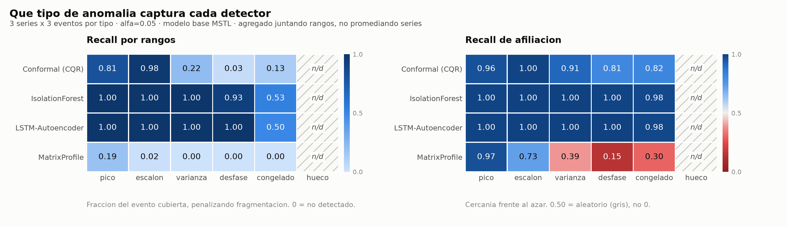
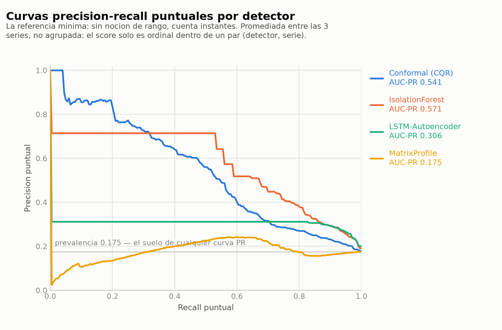

# Hallazgos de detección de anomalías

> **Estado:** resultados medidos, no propuesta de diseño.
> **Procedencia:** `scripts/run_anomaly_eval.py`, semilla `20240807`, panel horario
> sintético de 3 series. Tabla completa en `reports/results/anomaly_results.parquet`;
> figuras en `reports/figures/09_anomaly_heatmap.png` y `09_anomaly_pr_curves.png`.
> El diseño de las métricas está en `src/chronolab/evaluation/anomaly_metrics.py`;
> el de los detectores, en [`ANOMALY_DESIGN.md`](ANOMALY_DESIGN.md).

---

## 1. Qué se midió

4 detectores × 6 tipos de anomalía × 3 series, con **9 eventos inyectados por tipo**
(3 por serie). El montaje, en una tabla:

| | |
|---|---|
| Panel | 3 series horarias sintéticas, estacionalidad 24 y 168, 3504 h |
| Plan | `h=24`, teselado (`step_size=24`), deslizante con 1344 h de entrenamiento, `refit_every=1` |
| Ventanas | 90 (45 `dev` para calibrar, 45 `holdout` para puntuar) |
| Modelo base | MSTL con `AutoARIMA` de tendencia e intervalos conformales |
| Inyección | 54 eventos, solo en `holdout`; `dev` queda limpio |
| Umbral | `score >= -log10(0.05)`, el mismo para los cuatro |
| Soporte evaluado | 2979 instantes, intersección de las máscaras `scorable` |
| Prevalencia | **0.175** — 522 instantes anómalos de 2979 |

Las 45 ventanas de `holdout` se puntúan con detectores calibrados **solo** sobre las 45
de `dev`, y los cuatro se evalúan sobre la **intersección** de sus máscaras `scorable`
(§5.3 de la arquitectura): sin eso, un detector con ventana larga saldría favorecido por
haberse saltado el arranque de la serie, que es su parte peor condicionada.

**El umbral común es legítimo aquí y no siempre lo sería.** Los cuatro detectores emiten
`-log10(p)` con `p` un p-valor conformal, así que `alpha = 0.05` significa lo mismo en
los cuatro. Esa comparabilidad es una propiedad del diseño de los detectores, no de este
experimento.

---

## 2. El resultado principal: el ganador depende de la métrica

Éste es el hallazgo que justifica todo el módulo de métricas.

| métrica | 1.º | 2.º | 3.º | 4.º |
|---|---|---|---|---|
| `range_f1` | **Conformal** 0.456 | LSTM-AE 0.361 | IsoForest 0.242 | MatrixProfile 0.059 |
| `affiliation_f1` | **Conformal** 0.717 | LSTM-AE 0.699 | IsoForest 0.696 | MatrixProfile 0.300 |
| `auc_pr` | **IsoForest** 0.571 | Conformal 0.541 | LSTM-AE 0.306 | MatrixProfile 0.175 |
| `vus_pr` | **IsoForest** 0.133 | LSTM-AE 0.130 | Conformal 0.112 | MatrixProfile 0.061 |
| `range_recall` | **LSTM-AE** 0.900 | IsoForest 0.893 | Conformal 0.434 | MatrixProfile 0.041 |

Tres detectores distintos encabezan la tabla según qué se mida. El docstring de `auc_pr`
afirma que si el orden bajo AUC-PR puntual coincidiera con el de las métricas por rango,
todo el aparato del módulo sobraría; **aquí no coincide**, y esa es la comprobación
empírica de que hacía falta.

### Tabla global completa

Agregada sobre las 3 series. `n_obs = 2979`, `n_events = 45`.

| métrica | Conformal (CQR) | IsolationForest | LSTM-Autoencoder | MatrixProfile |
|---|---|---|---|---|
| `range_precision` | **0.480** | 0.140 | 0.226 | 0.107 |
| `range_recall` | 0.434 | 0.893 | **0.900** | 0.041 |
| `range_f1` | **0.456** | 0.242 | 0.361 | 0.059 |
| `affiliation_precision` | **0.704** | 0.541 | 0.545 | 0.664 |
| `affiliation_recall` | 0.730 | 0.974 | **0.975** | 0.194 |
| `affiliation_f1` | **0.717** | 0.696 | 0.699 | 0.300 |
| `auc_pr` (base 0.175) | 0.541 | **0.571** | 0.306 | 0.175 |
| `vus_pr` | 0.112 | **0.133** | 0.130 | 0.061 |
| `detection_rate` | 0.733 | 0.956 | **0.978** | 0.067 |
| `detection_delay_mean` | 4.24 | 0.00 | 0.45 | 0.67 |
| `false_alarms_per_1000` | 11.75 | 37.26 | 4.36 | **2.69** |
| tasa de marcado | 0.084 | 0.486 | 0.535 | 0.048 |

**La fila que reordena la lectura de todas las demás es la última.** IsolationForest y el
autoencoder marcan el **49 % y el 54 %** del `holdout`. Su recall de 0.89 y 0.90 no es
detección: es que marcando media serie se acierta casi cualquier cosa. La precisión por
rangos —0.140 y 0.226— es lo que lo delata, y el recall solo no lo habría hecho.

---

## 3. Detector × tipo: qué puede ver cada algoritmo



`range_recall` agregado juntando rangos de las 3 series (9 eventos por celda):

| | pico | escalón | varianza | desfase | congelado | hueco |
|---|---|---|---|---|---|---|
| Conformal (CQR) | 0.81 | **0.98** | 0.22 | 0.03 | 0.13 | n/d |
| IsolationForest | 1.00 | 1.00 | 1.00 | 0.93 | 0.53 | n/d |
| LSTM-Autoencoder | 1.00 | 1.00 | 1.00 | 1.00 | 0.50 | n/d |
| MatrixProfile | 0.19 | 0.02 | 0.00 | 0.00 | 0.00 | n/d |

Léanse las filas 2 y 3 recordando que esos detectores marcan la mitad del tramo. La fila
que contiene información es la primera; la cuarta es informativa por lo contrario.

### Conformal — ve el residuo, y solo el residuo

Su entrada es `r = max(l − y, y − u) / (u − l)`: cuánto se sale la observación del
intervalo que **el modelo base predijo**, normalizado por su anchura. No ve la serie: ve
el error del pronosticador. De ahí se deriva todo lo demás.

- **Escalón 0.98, pico 0.81 — su terreno.** Un desplazamiento sostenido de nivel es
  exactamente un residuo sostenido, y un pico es un residuo grande de un paso. Detecta el
  escalón con retardo mediano **0 pasos** y el pico con **0**: son las dos formas que un
  modelo estacional no puede absorber.
- **Varianza 0.22, congelado 0.13, desfase 0.03 — su punto ciego.** Los tres comparten un
  mecanismo: producen residuos **intermitentes**, no sostenidos. El cambio de varianza
  solo se sale del intervalo en las excursiones grandes; el sensor congelado empieza
  pegado a la predicción —el valor que se congela era normal hace un instante— y solo se
  despega según el ciclo diario real se aleja de la constante; el desfase estacional cruza
  la señal original dos veces por ciclo, y en esos cruces el residuo vuelve a cero. El
  detector marca los trozos y el factor de cardinalidad divide el recall entre ellos.
  Los retardos medios lo confirman: **9.4, 7.4 y 8.3 pasos** frente a 0.2 del escalón.
- Es el único cuyo marcado (0.084) queda en el orden de su `alpha` nominal (0.05). Los
  otros tres no están calibrados en el sentido en el que él lo está.

### IsolationForest — ve siete features, y una de ellas lo estropea

El vector es `(valor, residuo, z-score móvil, 1.ª derivada, 2.ª derivada, energía
espectral, hora)`. Con la energía espectral y las derivadas ve lo que el conformal no ve:
**varianza 1.00 y desfase 0.93** son suyos, y son precisamente los tipos donde el residuo
falla.

Pero marca el 49 % del tramo, y hay una explicación mecánica: **`valor` es una feature
cruda y la serie tiene tendencia**. El pool de calibración sale de `dev` y el tramo
puntuado es posterior, así que el nivel entero del `holdout` es más alto que cualquier
cosa que el bosque vio al ajustarse. Todo el tramo le parece raro. El síntoma es su
`false_alarms_per_1000 = 37.3` (111 falsas alarmas), el peor de los cuatro por un factor
de 3 a 14.

Lo interesante es que **su ranking sigue siendo el mejor**: `auc_pr = 0.571`, primero de
la tabla. Discriminación y calibración son cosas distintas, y aquí se separan de forma
limpia: el bosque ordena bien los instantes y sitúa fatal el umbral.

### LSTM-Autoencoder — ve la forma de 24 pasos, y poco más

Reconstruye ventanas de la objetivo escalada. Recall 1.00 en cuatro tipos, pero con el 54 %
del tramo marcado, así que la cifra no distingue.

Su patología es visible en la curva PR: **el 49.4 % de sus scores están exactamente en el
techo** (`log10(n_pool + 1) ≈ 2.96`). Medio `holdout` empatado en el valor máximo. Eso es
lo que dibuja el tramo plano de su curva y lo que hunde su `auc_pr` a 0.306 pese al recall
de 0.90: **dentro de esa mitad no puede ordenar nada**. El error de reconstrucción de casi
cualquier ventana del `holdout` supera todo el pool de calibración, así que el p-valor se
satura y la información se pierde. Es el modo de fallo que la columna `severity` existe
para romper, y la razón de que el protocolo obligue a emitirla.

En congelado (0.50) se queda a medias por geometría: la ventana son 24 pasos y el
congelado dura 10-12, así que el error de reconstrucción sube al entrar el tramo plano en
la ventana y sigue alto 24 pasos más, cubriendo el evento pero desbordándolo.

### MatrixProfile — está exactamente al azar, y se puede decir por qué

`auc_pr = 0.175` con prevalencia `0.175`. **Es la definición de estar al azar**, y es la
razón de que `CurveReport` devuelva el área pegada a su línea base: sin ella, un 0.175
sonaría a "flojo pero algo hace".

La causa no es un fallo de implementación sino la **z-normalización**, que es constitutiva
del perfil de matriz: cada subsecuencia se centra en su media y se escala por su
desviación antes de compararla.

- **Escalón 0.02 y varianza 0.00 son invisibles por construcción.** Un desplazamiento de
  nivel puro es un cambio de media, y un cambio de varianza puro es un cambio de escala:
  la z-normalización elimina exactamente esas dos cosas. Después de normalizar, la
  subsecuencia desplazada es *idéntica* a una normal.
- **Congelado 0.00**: una subsecuencia constante tiene desviación cero y la normalización
  la divide por cero (el `RuntimeWarning` de `stumpy` que aparece en el log del run).
  El caso degenerado no se convierte en "máximamente distinta".
- **Desfase 0.00**: un día desfasado sigue pareciéndose a *otro* día de la serie, porque
  el patrón se repite. Tiene vecino cercano, luego no es un *discord*.
- **Pico 0.19** es el único que ve, y es coherente: un pico sí deforma la forma.

Su `affiliation_recall` en picos (0.97) frente a su `range_recall` (0.19) dice que cae
**cerca** de los picos sin solaparlos. Con solape estricto eso es indistinguible de no
detectar nada; es justo la distinción para la que existe la métrica de afiliación.

Como referencia de contraste, cumple su función: **fija el suelo**. Un detector que no lo
bata claramente no está aportando nada.

### El hueco de datos no es trabajo de un detector

Los 9 eventos de tipo `data_gap` (54 instantes) tienen **0 instantes dentro del soporte
evaluable**. Un hueco es `y = NaN`, y los cuatro detectores lo marcan `scorable=False`
porque no hay observación que puntuar. La columna sale `n/d` para todos y `n_events` global
baja de 54 a **45**.

No es un defecto del arnés: es el resultado. Detectar que falta un dato es trabajo de
`data/quality.py`, que mira la rejilla, no de un detector que puntúa valores. La tabla
`anomaly_truth` de la arquitectura (§7.4) lista cinco tipos y no seis, y este experimento
enseña por qué esa lista era la correcta.

Con un matiz que sí importa y que el arnés registra: `n_support_gaps = 9` para los cuatro
detectores, un agujero por cada hueco inyectado. Quitar instantes no puntuables junta
tramos que en el tiempo no eran contiguos, y quien lea una precisión por rangos tiene
derecho a saber cuántas veces pasó.

---

## 4. Curvas precisión-recall



Promediadas entre las 3 series y **no agrupadas**: `FittedDetector.score` declara que el
score es ordinal solo *dentro* de un par (detector, serie), así que juntar los rankings de
tres series produciría una curva que ningún umbral genera.

Tres lecturas que la tabla no da:

1. **Conformal es el único con una curva suave.** Degrada de forma continua desde
   precisión 1.0: su score ordena de verdad en todo el rango.
2. **Los tramos planos de IsolationForest y del autoencoder son empates.** Una curva PR
   horizontal significa que muchísimos instantes comparten score exacto. El autoencoder
   arranca plano en 0.31 y se mantiene ahí hasta recall ≈ 0.85: en ese tramo no hay ningún
   umbral que le dé más precisión que otro. IsolationForest hace lo mismo en 0.71 hasta
   recall ≈ 0.53.
3. **MatrixProfile abraza la línea de prevalencia** por debajo y por encima. Es la firma
   visual de estar al azar.

---

## 5. Métricas operativas

| | Conformal | IsoForest | LSTM-AE | MatrixProfile |
|---|---|---|---|---|
| eventos detectados | 33/45 | 43/45 | 44/45 | 3/45 |
| retardo medio (pasos) | 4.24 | 0.00 | 0.45 | 0.67 |
| falsas alarmas | 35 | 111 | 13 | 8 |
| falsas alarmas / 1000 obs | 11.75 | 37.26 | 4.36 | 2.69 |

**El retardo es la métrica más fácil de leer al revés de todo el cuadro.** IsolationForest
exhibe un retardo medio de **0.00 pasos en los cinco tipos**: avisa siempre en el primer
instante del evento. Leído solo, es un resultado excelente. Leído junto a su tasa de
marcado (0.486), es una tautología: quien marca la mitad del tramo ya estaba marcando
cuando el evento empezó.

MatrixProfile enseña el otro extremo: retardo medio 0.67, el segundo mejor, sobre los
**3 eventos de 45** que detectó. La media está condicionada a haber detectado, y por eso
`OperationalReport` emite `detection_rate` y `delays` en el mismo objeto: no hay forma de
citar uno sin el otro.

El único retardo que significa algo es el de Conformal, porque es el único con una tasa de
marcado comparable a su `alpha`: 0 pasos en escalón y pico, 7-9 en los tres tipos de
residuo intermitente.

---

## 6. Lo que este experimento **no** dice

Cinco límites que hay que declarar para que los números de arriba se puedan usar.

1. **La prevalencia es 0.175, no la de un problema real.** Se inyectaron 522 instantes
   anómalos en 2979. En operación la prevalencia de anomalías está dos órdenes de magnitud
   por debajo. Consecuencia directa: todas las precisiones y todos los AUC-PR de este
   documento están **inflados**, porque el suelo de una curva PR es la prevalencia.
   Las conclusiones del lado del recall (§3) no dependen de ella; las del lado de la
   precisión, sí. Un run con anomalías escasas es el siguiente paso obvio.
2. **Un solo modelo base.** Dos de los cuatro detectores puntúan residuos de MSTL, así que
   sus resultados son condicionales a ese modelo. Se eligió MSTL sobre el naive estacional
   precisamente para no medir el modelo en vez del detector —el naive repite cada anomalía
   un ciclo después y fabricaría un falso positivo garantizado— pero la dependencia sigue
   ahí.
3. **La calibración vio datos limpios.** Las anomalías se inyectaron solo en `holdout`. En
   producción se calibra sobre datos que ya las contienen. Es una idealización que favorece
   a los cuatro por igual, pero favorece.
4. **Series sintéticas.** Estacionalidad exacta, ruido gaussiano, sin festivos ni cambios
   de régimen reales. La tendencia lineal del generador es, de hecho, la que estropea a
   IsolationForest (§3): en una serie real el efecto existiría igual, pero mezclado con
   otros.
5. **Hiperparámetros sin ajustar.** Ninguno de los cuatro se tuneó sobre `dev`. Con
   `pool_size`, `window` o `trim_z` ajustados, los números cambiarían; el ajuste es
   legítimo sobre `dev` y está pendiente.

---

## 7. Consecuencias para el proyecto

- **El leaderboard de anomalías necesita al menos tres columnas**, no una: una métrica por
  rangos, una de afiliación y una de curva. El orden cambia entre ellas (§2), así que
  publicar una sola es elegir el ganador.
- **La tasa de marcado tiene que aparecer al lado de cualquier recall.** Sin ella, el
  recall de 0.90 del autoencoder y el 0.89 de IsolationForest se leen como detección.
- **`severity` no es opcional.** El autoencoder satura la mitad de sus scores; sin la
  columna sin acotar no hay forma de ordenar dentro de esa mitad.
- **`valor` como feature cruda de IsolationForest es un problema documentado**, no un
  accidente de esta corrida: cualquier serie con tendencia lo reproducirá. Sustituirlo por
  el valor desestacionalizado o por una diferencia es el arreglo natural, y es medible con
  este mismo arnés.

---

## 8. Reproducir

```bash
uv run --extra ml --extra deep python scripts/run_anomaly_eval.py   # ~15 min
uv run --extra ml --extra deep python scripts/run_anomaly_eval.py --figures-only
```

El primero corre el backtest (90 ventanas de MSTL, ~815 s), calibra y puntúa los cuatro
detectores, evalúa y persiste. El segundo redibuja desde los artefactos ya escritos. Todo
está sembrado con `SEED = 20240807`; el panel, la inyección y los cuatro detectores son
deterministas.

Tres bugs que esta evaluación destapó y que quedan corregidos y con test:

| | Síntoma | Causa |
|---|---|---|
| 1 | 32 de 90 ventanas fallidas, soporte al 28.8 % | El adaptador de statsforecast no imputaba, pese a declarar `handles_nan_target=False`, que según §5.2 obliga a hacerlo dentro de `fit`. Un hueco en el entrenamiento tumbaba la ventana entera |
| 2 | La comparativa abortaba entera | `MatrixProfile` emitía `ds` en microsegundos y el resto en nanosegundos |
| 3 | `common_scorable_mask` demasiado estricta | Comparaba la representación de la rejilla y no la rejilla |
